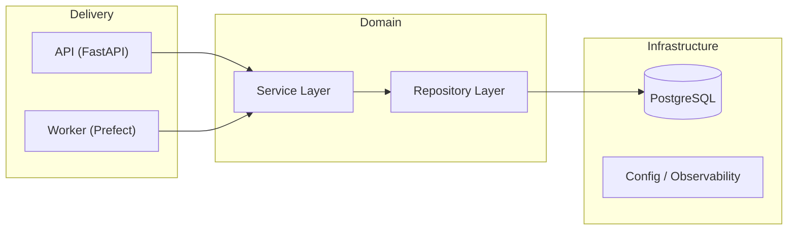

# FastAPI Template — Domain-Driven Design

[](https://github.com/mariusvinaschi/fastapi-template/actions/workflows/ci.yml)
[](https://github.com/mariusvinaschi/fastapi-template/releases)
[](LICENSE)
[](https://www.python.org/downloads/)
[](https://www.docker.com/)

A production-ready FastAPI template built around **Domain-Driven Design (DDD)** principles. It provides a clean, composable architecture with built-in authentication, authorization, async workers, observability, and a full CI/CD pipeline, ready to be cloned and extended.

---

## Table of Contents

- [Stack](#stack)
- [Features](#features)
- [Architecture](#architecture)
  - [Domain-First Design](#domain-first-design)
  - [Layer Separation](#layer-separation)
  - [Two-Layer Authorization](#two-layer-authorization)
  - [Multi-Stage Dockerfile](#multi-stage-dockerfile)
- [Quick Start](#quick-start)
  - [Prerequisites](#prerequisites)
  - [Local Setup](#local-setup)
  - [Docker Setup](#docker-setup)
  - [Prefect Workers](#prefect-workers)
- [API Reference](#api-reference)
- [Environment Variables](#environment-variables)
- [Commands](#commands)
- [Tests](#tests)
- [Observability](#observability)
- [CI/CD](#cicd)
- [Versioning & Releases](#versioning--releases)
- [Adding a New Domain](#adding-a-new-domain)
- [Contributing](#contributing)
- [License](#license)
- [Author](#author)

---

## Stack

| Layer | Technology |
|---|---|
| API framework | [FastAPI](https://fastapi.tiangolo.com/) |
| ORM | [SQLAlchemy](https://www.sqlalchemy.org/) (async) |
| Database | PostgreSQL 17 |
| Migrations | [Alembic](https://alembic.sqlalchemy.org/) |
| Auth | [Clerk](https://clerk.com/) (JWT RS256) + API Key (HMAC-SHA256) |
| Workers | [Prefect](https://www.prefect.io/) |
| Observability | [Pydantic Logfire](https://pydantic.dev/logfire) (OpenTelemetry) |
| Package manager | [uv](https://docs.astral.sh/uv/) |
| Linter / Formatter | [Ruff](https://docs.astral.sh/ruff/) |
| Type checker | [ty](https://github.com/astral-sh/ty) |
| Task runner | [just](https://just.systems/) |
| CI/CD | GitHub Actions |

---

## Features

- **DDD architecture** — business logic in `app/domains/` with zero framework dependencies
- **Composable CRUD mixins** — `List`, `Read`, `Create`, `Update`, `Delete`, `Bulk*` at repository and service levels
- **Two-layer authorization** — permission checks (service, deny-by-default) + query-level data scoping (repository)
- **Request-scoped Unit of Work** — repositories `flush()`, the transaction commits once per request (`get_session`) or per flow (`get_prefect_db_session`)
- **Rate limiting** — [SlowAPI](https://github.com/laurentS/slowapi) middleware wired in, `@limiter.limit(...)` ready on any route
- **Dual authentication** — Clerk JWT and API Key (HMAC-SHA256), both ready out of the box
- **Clerk webhook sync** — automatically syncs users on `user.created`, `user.updated`, `user.deleted`
- **Async database** — SQLAlchemy async engine with `asyncpg`
- **Prefect workers** — async task execution with a Docker work pool
- **Multi-stage Dockerfile** — one file produces three independent images: `api`, `worker`, `migrations`
- **Full observability** — Logfire with FastAPI and SQLAlchemy instrumentation (cloud or self-hosted OTLP)
- **Automated versioning** — Release Candidates on every merge, stable releases on demand
- **Pre-commit hooks** — Ruff (format + check) and Conventional Commits enforced via [prek](https://prek.j178.dev/)

---

## Architecture

### Domain-First Design

Business logic lives exclusively in `app/domains/` and has **zero dependencies** on FastAPI, Prefect, or any framework. FastAPI and Prefect are adapters that consume the domain — never the other way around.

```
app/domains/
├── base/                   # Shared abstractions
│   ├── authorization.py    # AuthorizationContext, ScopeStrategy
│   ├── exceptions.py
│   ├── factory.py          # Test factory base class
│   ├── filters.py
│   ├── models.py           # Base ORM model + UUID/Timestamp/CreatedBy mixins
│   ├── repository.py       # Composable CRUD repository mixins
│   ├── schemas.py          # Base Pydantic schemas
│   └── service.py          # Composable service mixins
└── users/                  # User domain (example implementation)
    ├── authorization.py
    ├── exceptions.py
    ├── factory.py
    ├── filters.py
    ├── models.py           # User, APIKey ORM models
    ├── repository.py       # UserRepository, APIKeyRepository
    ├── schemas.py          # UserRead, UserCreate, UserPatch, APIKeyGenerated…
    └── service.py          # UserService, ClerkUserService, APIKeyService
```

### Layer Separation

```
app/
├── api/            # HTTP delivery layer (FastAPI routes, dependencies, exceptions)
├── domains/        # Pure business logic (framework-agnostic)
├── workers/        # Async processing (Prefect flows and tasks)
└── infrastructure/ # Cross-cutting concerns (DB, config, observability, middleware)
```



### Two-Layer Authorization

This template implements **defense-in-depth authorization** that separates *what actions are allowed* from *what data is visible*.

```
API Route
  └─► Service  (for_user / for_system)
        ├─► Permission Check  — CAN the user perform this action?
        │     ├── _check_general_permissions(action)
        │     └── _check_instance_permissions(action, instance)
        └─► Repository
              └─► Scope Filter  — WHAT data can the user see?
                    └── _apply_user_scope(query)
                          ├── context is None → unfiltered  (system)
                          └── context exists → scope_strategy.apply_scope(query, ctx)
```

**Key components:**

**`AuthorizationContext`** — abstract interface carrying `user_id`, `user_email`, `user_role`.

**`AuthorizationScopeStrategy`** — defines *how* to filter SQL queries per domain:

```python
class APIKeyScopeStrategy(AuthorizationScopeStrategy):
    def apply_scope(self, query: Select, context: AuthorizationContext) -> Select:
        return query.where(self.model.user_id == context.user_id)
```

**Factory methods** make the authorization mode explicit in code:

```python
# All API endpoints — operates with user context
service = UserService.for_user(session, authorization_context)

# Background jobs, webhooks, admin scripts — bypasses all checks
service = UserService.for_system(session)
```

**Security guarantees:**

1. Both layers must be bypassed simultaneously for unauthorized access
2. Filtering happens at the SQL level — unauthorized data never leaves the database
3. `for_system()` makes privileged operations clearly visible in code reviews
4. Type-safe: `apply_scope` never receives a `None` context (the repository guards this)
5. **Deny-by-default permissions** — in user context, only `read` and `list` are allowed out of the box; every other action raises `PermissionDenied` unless the service subclass whitelists it (via `_default_allowed_user_actions` or a `_check_general_permissions` override)
6. `bulk_delete` is scoped at the SQL level too — a user cannot delete rows outside their scope by supplying arbitrary IDs

### Transaction Boundary (Unit of Work)

Repositories never commit. Mutations only `flush()` so changes are visible within the
transaction; the commit happens exactly once, at the boundary that owns the request:

| Boundary | Where | Behavior |
|---|---|---|
| HTTP request | `get_session` (`app/infrastructure/database.py`) | Commit on success, rollback on any exception |
| Prefect flow/task | `get_prefect_db_session` | Same contract; explicit intermediate commits allowed as durable checkpoints before external side-effects |

This makes each HTTP request a single atomic Unit of Work: multiple service calls in one
route either all persist or none do, and services never need to think about transactions.

### Multi-Stage Dockerfile

One repository, one Dockerfile, three independent images:

```bash
docker build --target api        -t myapp:api .
docker build --target worker     -t myapp:worker .
docker build --target migrations -t myapp:migrations .
```

| Target | Content | Entry point |
|---|---|---|
| `api` | Full `app/` | `fastapi run --workers 4` |
| `worker` | `domains/`, `infrastructure/`, `workers/` (no `api/`) | Prefect worker |
| `migrations` | `app/` + `alembic/` | `alembic upgrade head` |

---

## Quick Start

### Prerequisites

- Python 3.13+
- Docker & Docker Compose
- [`just`](https://just.systems/en/latest/install/) — task runner
- [`uv`](https://docs.astral.sh/uv/getting-started/installation/) — Python package manager

### Local Setup

```bash
# 1. Clone the repository
git clone https://github.com/mariusvinaschi/fastapi-template.git
cd fastapi-template

# 2. Copy and configure environment variables
cp .env.sample .env

# 3. Install dependencies
just install

# 4. Install git hooks (Ruff + Conventional Commits)
just prek-install

# 5. Start the database
docker compose up -d dbapp

# 6. Run migrations
just migrate

# 7. Start the API server
just dev
```

The API is now available at `http://localhost:8000`.
Interactive docs: `http://localhost:8000/docs` (Swagger UI) or `http://localhost:8000/redoc` (ReDoc).

### Docker Setup

```bash
# Build all images (api, worker, migrations)
just docker-build-all

# Start all services
just docker-up

# View logs
just docker-logs

# Stop everything
just docker-down
```

**Using a pre-built image from the registry:**

```bash
export API_IMAGE=ghcr.io/mariusvinaschi/fastapi-template/api:latest
just docker-up-registry
```

### Prefect Workers

To run the full stack with Prefect locally:

```bash
# 1. Start Prefect services (server + UI at http://localhost:4200)
just docker-up-prefect

# 2. Start the app and worker
just docker-up-app

# 3. Initialize Prefect (work pool + SQLAlchemy block)
export PREFECT_API_URL="http://0.0.0.0:4200/api"
export PREFECT_API_AUTH_STRING="admin:pass"  # align with PREFECT_LOGIN_USER/PASSWORD in .env
just init-prefect

# 4. Build the worker image
just docker-build-worker

# 5. Deploy flows
prefect deploy --all

# 6. Trigger runs from the Prefect UI or CLI
```

Two flows are defined in `prefect.yaml`: `create-user-flow` and `web-scrapper-flow`.

**Development shortcut** — instead of steps 4–5, serve the flows in a local process
(no Docker rebuild, deployment names stay identical):

```bash
export PREFECT_API_URL="http://localhost:4200/api"
just serve-flows
```

---

## Environment Variables

Copy `.env.sample` to `.env` and adjust the values. Variables are grouped by category below.

### Database

| Variable | Default | Description |
|---|---|---|
| `APP_DB_NAME` | `fastapitemplatedb` | PostgreSQL database name |
| `APP_DB_USER` | `fastapitemplateuser` | PostgreSQL user |
| `APP_DB_PASSWORD` | `fastapitemplatepassword` | PostgreSQL password |
| `APP_DB_HOST` | `dbapp` | PostgreSQL host |
| `APP_DB_PORT` | `5432` | PostgreSQL port |

### Authentication (Clerk)

| Variable | Default | Description |
|---|---|---|
| `CLERK_FRONTEND_API_URL` | — | Clerk frontend API URL (JWKS issuer) |
| `CLERK_ALGORITHMS` | `RS256` | JWT signing algorithm |
| `CLERK_AZP` | `http://localhost:3000` | Allowed `azp` claim (your frontend origin) |
| `CLERK_WEBHOOK_SECRET` | — | Webhook signing secret from Clerk dashboard |

### CORS

| Variable | Default | Description |
|---|---|---|
| `CORS_ORIGINS` | `http://localhost:3000` | Comma-separated list of allowed origins |

### Default User

| Variable | Default | Description |
|---|---|---|
| `DEFAULT_USER` | `admin@admin.com` | Email of the default user created by `just create-user` |
| `DEFAULT_USER_ROLE` | `admin` | Role assigned to the default user |

### Prefect

| Variable | Default | Description |
|---|---|---|
| `PREFECT_API_URL` | `http://prefect-server:4200/api` | Prefect server URL |
| `PREFECT_LOGIN_USER` | `prefectuser` | Prefect UI username |
| `PREFECT_LOGIN_PASSWORD` | `prefectpassword` | Prefect UI password |
| `WORK_POOL_NAME` | `fastapi-template-pool` | Prefect Docker work pool name |
| `WORK_QUEUE_NAME` | `default` | Prefect work queue name |
| `PREFECT_BLOCK_NAME_SQLALCHEMY` | `dbapp-sqlalchemy` | Name of the Prefect SQLAlchemy block |

### Observability (Logfire)

| Variable | Default | Description |
|---|---|---|
| `LOGFIRE_SEND_TO_LOGFIRE` | `true` | Send traces to Logfire cloud |
| `LOGFIRE_TOKEN` | — | Write token from Logfire dashboard |

### Docker Images (optional)

| Variable | Description |
|---|---|
| `API_IMAGE` | Override the API image (e.g. `ghcr.io/mariusvinaschi/fastapi-template/api:latest`) |
| `WORKER_IMAGE` | Override the worker image |
| `MIGRATIONS_IMAGE` | Override the migrations image |

---

## Commands

Run `just --list` to see all available commands.

### Development

| Command | Description |
|---|---|
| `just install` | Install dependencies with uv |
| `just dev` | Run the API in development mode (hot reload) |
| `just prek-install` | Install git hooks (Ruff + Conventional Commits) |
| `just prek-run` | Run hooks manually on all files |

### Testing & Quality

| Command | Description |
|---|---|
| `just test` | Run all tests |
| `just test-cov` | Run tests with coverage report (HTML + terminal) |
| `just lint` | Run Ruff linter on `app/` |
| `just format` | Format code with Ruff |
| `just type-check` | Type check with ty |

### Database

| Command | Description |
|---|---|
| `just migrate` | Apply all pending migrations (`alembic upgrade head`) |
| `just migrate-create "description"` | Generate a new autogenerated migration |
| `just migrate-down` | Roll back the last migration |
| `just migrate-history` | Show migration history |

### Users & Prefect

| Command | Description |
|---|---|
| `just create-user` | Create a default user (uses `DEFAULT_USER` / `DEFAULT_USER_ROLE`) |
| `just init-prefect` | Initialize Prefect work pool and SQLAlchemy block |
| `just serve-flows` | Serve all Prefect flows in a local process (no Docker rebuild) |

### Docker

| Command | Description |
|---|---|
| `just docker-build-all` | Build all images (api, worker, migrations) |
| `just docker-build-worker` | Build the worker image only |
| `just docker-up` | Start all services (app + Prefect) |
| `just docker-up-app` | Start app services only (db, migrations, api, worker) |
| `just docker-up-prefect` | Start Prefect services only (server, UI, db) |
| `just docker-up-registry` | Start using images from the registry (`API_IMAGE` must be set) |
| `just docker-down` | Stop all services |
| `just docker-logs` | Show app logs |

### Cleanup

| Command | Description |
|---|---|
| `just clean` | Remove caches (`__pycache__`, `.pytest_cache`, `.ruff_cache`, `.coverage`, `htmlcov`) |
| `just clean-docker` | Remove Docker images and volumes (app + Prefect) |

---

## Tests

Tests are located in `tests/` and use `pytest` with async support (`pytest-asyncio`, strict mode).

Tests run against a **dedicated test database**: `tests/conftest.py` redirects `APP_DB_NAME`
to `APP_DB_TEST_NAME` (default `fastapi_template_test`) before any `app.*` import, so your
development data is never touched. Create it once:

```sql
CREATE DATABASE fastapi_template_test;
```

```bash
# Run all tests
just test

# Run with coverage report
just test-cov
```

### Test Structure

```
tests/
├── conftest.py          # Fixtures: app, async HTTP client, DB session (create/drop per test)
├── core/                # Unit tests for all repository and service mixins
├── security/            # JWT and API Key authentication tests
├── users/
│   ├── api/             # HTTP endpoint integration tests
│   ├── repository/      # find_by_email, find_by_clerk_id
│   └── service/         # UserService, ClerkUserService (permissions, queries)
├── test_health.py
└── utils/ & validations/
```

Each test function creates and drops all tables in the test database — real PostgreSQL, no mocks for the database layer.

---

## Observability

This template uses **[Pydantic Logfire](https://pydantic.dev/logfire)** as its observability platform, a production-grade solution built on [OpenTelemetry](https://opentelemetry.io/) that provides logs, traces, and metrics in a unified view.

### What is instrumented

| Layer | Instrumentation |
|---|---|
| **FastAPI** | All HTTP requests and responses (latency, status codes, routes) |
| **SQLAlchemy** | Every database query with execution time |
| **Custom spans** | Add your own spans anywhere with `logfire.span()` |

### Configuration

Logfire is configured in `app/infrastructure/observability.py` and activated at application startup.

**Cloud (default)** — send traces directly to the [Logfire platform](https://pydantic.dev/logfire):

```bash
# In your .env
LOGFIRE_SEND_TO_LOGFIRE=true
LOGFIRE_TOKEN=your-write-token   # obtain from the Logfire dashboard
```

### Adding custom traces

```python
import logfire

with logfire.span("process-order", order_id=order.id):
    result = await order_service.process(order)
    logfire.info("Order processed", status=result.status)
```

---

## CI/CD

Three GitHub Actions workflows handle validation, versioning, and image publishing.

| Workflow | File | Trigger | What it does |
|---|---|---|---|
| **CI** | `ci.yml` | PR and push to `main` | Type check (`ty`), lint/format (`ruff`), tests (`pytest` + PostgreSQL 17) |
| **Release** | `release.yml` | Push to `main` + manual dispatch | Creates RC or stable version, pushes tag, creates GitHub Release |
| **Build & Push** | `build-images.yml` | Tags matching `vX.Y.Z` | Builds multi-arch images (`amd64`/`arm64`), pushes `api`, `worker`, `migrations` to GHCR |

### End-to-End Flow

```
PR opened  →  CI validates (type-check, lint, tests)
               ↓
Merge to main  →  Release creates 1.2.3-rc.1 automatically
               ↓
Manual release (patch/minor/major)  →  stable tag v1.2.3 created
               ↓
Tag pushed  →  Docker images built and pushed to GHCR
```

### Deploy Key Setup

The `Release` workflow commits back to `main` and requires an SSH deploy key stored as the `DEPLOY_KEY` secret.

```bash
# 1. Generate a key pair
ssh-keygen -t ed25519 -C "fastapi-template-release" -f ./deploy-key -N ""

# 2. Add the public key in GitHub
#    Repository Settings → Deploy keys → Add deploy key → Allow write access

# 3. Add the private key as a secret
#    Repository Settings → Secrets and variables → Actions → New secret: DEPLOY_KEY
```

---

## Versioning & Releases

Each merge to `main` automatically creates the next Release Candidate. Stable releases are triggered manually.

```
push to main  →  1.2.3-rc.1  (automatic)
push to main  →  1.2.3-rc.2  (automatic)

Manual: patch  →  1.2.3  + tag v1.2.3
push to main  →  1.2.4-rc.1  (new cycle)

Manual: minor  →  1.3.0  + tag v1.3.0
Manual: major  →  2.0.0  + tag v2.0.0
```

**To create a stable release:**

1. Go to **GitHub Actions** → **Release**
2. Click **Run workflow**
3. Choose the bump type:

| Type | Example | When to use |
|---|---|---|
| `patch` | `1.2.3 → 1.2.4` | Bug fixes, small improvements |
| `minor` | `1.2.3 → 1.3.0` | New features, backward compatible |
| `major` | `1.2.3 → 2.0.0` | Breaking changes |

### Commit Convention

Commits are enforced locally via [prek](https://prek.j178.dev/) and [Commitizen](https://commitizen-tools.github.io/commitizen/).

```bash
feat: add user dashboard
fix: resolve login timeout issue
feat(auth): add JWT refresh
refactor: simplify auth middleware
docs: update API documentation
test: add integration tests for users
chore: update dependencies
```

Supported types: `feat`, `fix`, `docs`, `style`, `refactor`, `perf`, `test`, `build`, `ci`, `chore`.

---

## Adding a New Domain

1. **Create the domain folder:**

```bash
mkdir -p app/domains/myentity
```

2. **Add the required files:**

| File | Purpose |
|---|---|
| `models.py` | SQLAlchemy ORM models |
| `schemas.py` | Pydantic DTOs (request/response) |
| `repository.py` | Data access layer (compose CRUD mixins) |
| `service.py` | Business logic (compose service mixins) |
| `exceptions.py` | Domain-specific exceptions |
| `authorization.py` | Scope strategy (if data scoping is needed) |

3. **Register models** in `alembic/env.py` so Alembic detects them.

4. **Create API routes** in `app/api/routes/myentity.py` and register them in `app/api/router.py`.

5. **(Optional)** Add Prefect flows in `app/workers/`.

### Authorization Quickstart

```python
# app/domains/myentity/authorization.py
class MyEntityScopeStrategy(AuthorizationScopeStrategy):
    def apply_scope(self, query: Select, context: AuthorizationContext) -> Select:
        return query.where(self.model.owner_id == context.user_id)

# app/domains/myentity/service.py
class MyEntityService(BaseService):
    def _check_general_permissions(self, action: str) -> bool:
        if action == "delete" and self.authorization_context.user_role != "admin":
            raise PermissionDenied("Only admins can delete")
        return True

    def _check_instance_permissions(self, action: str, instance: MyEntity) -> bool:
        if action == "update" and instance.owner_id != self.authorization_context.user_id:
            raise PermissionDenied("Can only update your own entities")
        return True
```

> **Important notes:**
> - Permissions are **deny-by-default**: in user context only `read` and `list` are allowed. Whitelist additional actions per service via `_default_allowed_user_actions` or a `_check_general_permissions` override.
> - Custom repository methods (e.g. `find_by_email`) should call `_apply_user_scope` on their query. If a method intentionally bypasses scoping, its permissions must be validated in the service layer.
> - Always use `for_system()` explicitly for background operations — never pass `None` as `authorization_context` directly.

---

## License

This project is licensed under the [MIT License](LICENSE).

---

## Author

**Marius Vinaschi**

- GitHub: [@mariusvinaschi](https://github.com/mariusvinaschi)
